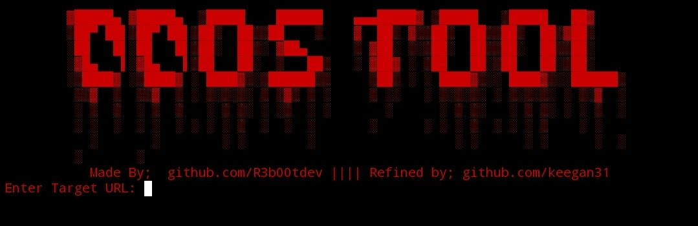

## DDOS-TOOL-V1 
\# DDOS-TOOL — Simulated Network Load Testing Tool (Free Version)


DDOS-TOOL is a \*\*simulated network load testing tool (command-line)\*\* created by R3b00t for educational and research purposes. It is designed to \*\*model high volumes of HTTP-based traffic in isolated lab environments only\*\*. The project supports multiple simulation modes, optional proxy configuration for controlled lab topologies, and real-time logging to monitor simulated activity effectively. 🖥️


---


## 🧩 Features

\- 🔗 Target any HTTP/HTTPS URL (authorized lab targets only)   

\- 🔁 Custom request counts (e.g. 10, 100, 1000)  

\- 🖥️ Command-line interface (no GUI) with clear progress reporting  

\- 📊 Real-time logging, statistics and progress tracking  


---


## 🧰 Requirements

The minimal dependencies are listed in `requirements.txt`:


Install dependencies via pip:
```
pip install -r requirements.txt
```


## 🔐 Re-Fined By keegan31
Added Termux Support 
Added More Proxies
200-400 Req/s Average

## Install Via Terminal 💻
```
git clone https://github.com/keegan31/DDOS-TOOL-V1.git
```


